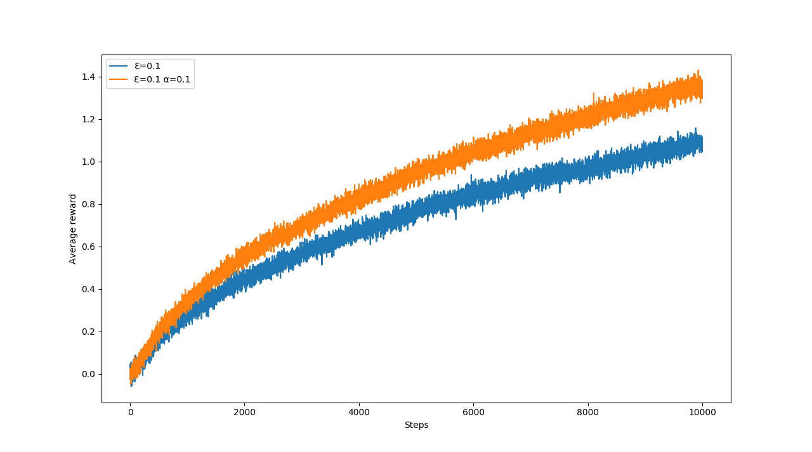
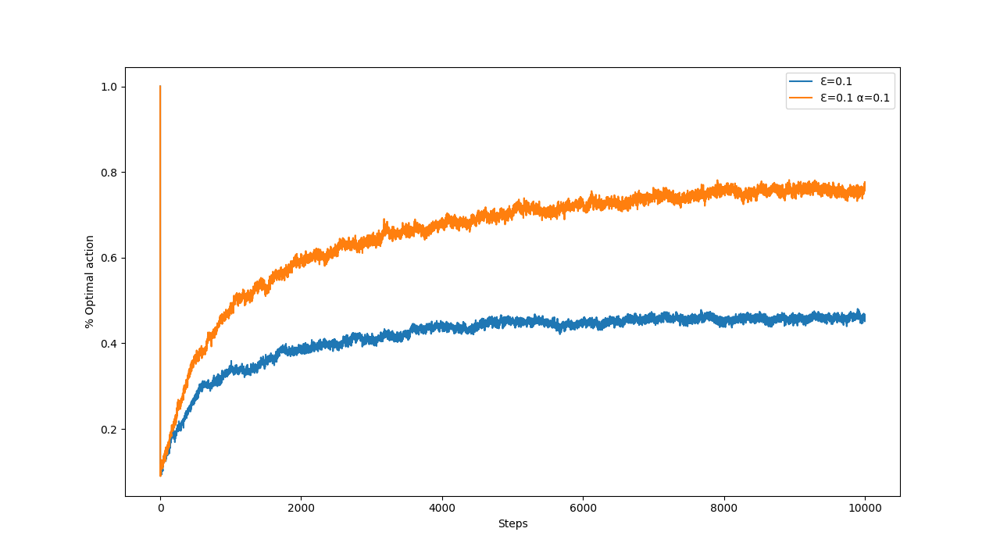

# Exercise 2.5

## Question:
Design and conduct an experiment to demonstrate the difficulties that
sample-average methods have for non-stationary problems. Use a modified
version of the 10-armed testbed in which all the q\*(a) start out equal and
then take independent random walks (say by adding a normally distributed
increment with mean zero and standard deviation 0.01 to all the q\*(a)
on each step. Prepare plots like Figure 2.2 for an
action-value method using sample averages, incrementally computed,
and another action-value method using a constant step-size
parameter, α = 0.1. Use ε = 0.1 and longer runs, say of 10,000 steps.

## Answer:
Run Exercise 2.5.py

